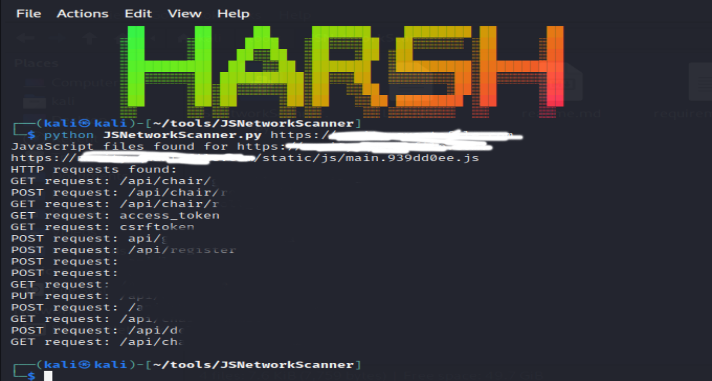

# JSNetworkScanner


## Description

JSNetworkScanner is a command-line tool for analyzing JavaScript files on a website to identify HTTP requests. It helps you understand the network activity and communication happening within JavaScript files, aiding in web development and security analysis.

## Features

- Fetches JavaScript files from a website
- Identifies HTTP GET, POST, PUT, and DELETE requests within JavaScript files
- Excludes common libraries and CDNs by default
- Supports single URL input, URLs from a text file, and output to a text file
- Allows excluding additional libraries using the `-e` or `--exclude` argument

## Installation

1. Clone the repository:

   ```bash
   git clone https://github.com/iamharshkr/JSNetworkScanner.git
2. Navigate to the repository folder:
    ```bash
    cd JSNetworkScanner
3. Install dependencies:

    ```bash
    pip install -r requirements.txt
## Usage

Run the script using the following commands:

1. For a single URL:
    ```bash
    python JSNetworkScanner.py https://example.com
    # or
    python JSNetworkScanner.py https://example.com/app.js
2. For URLs from a text file:
    ```bash
    python JSNetworkScanner.py -f urls.txt
3. For output to a text file:
    ```bash
    python JSNetworkScanner.py -f urls.txt -o output.txt
4. To exclude additional libraries:
    ```bash
    python script_name.py https://example.com -e jquery,moment,axios
5. Use the -h or --help flag for detailed usage information:
    ```bash
    python JSNetworkScanner.py -h
## Examples

1. Analyzing a single website:
    ```bash
    python JSNetworkScanner.py https://example.com
2. Analyzing multiple websites from a text file and saving the output:
    ```bash
    python JSNetworkScanner.py -f websites.txt -o results.txt
3. Analyzing a website and excluding specific libraries:
    ```bash
    python JSNetworkScanner.py https://example.com -e jquery,moment,axios
## Screenshot

## License
This project is licensed under the MIT License - see the LICENSE file for details.

## Credits
Beautiful Soup\
jsbeautifier

## Feedback and Contribution
Feedback, bug reports, and contributions are welcome! Feel free to open issues or submit pull requests.

## Author
Harsh Kumar
